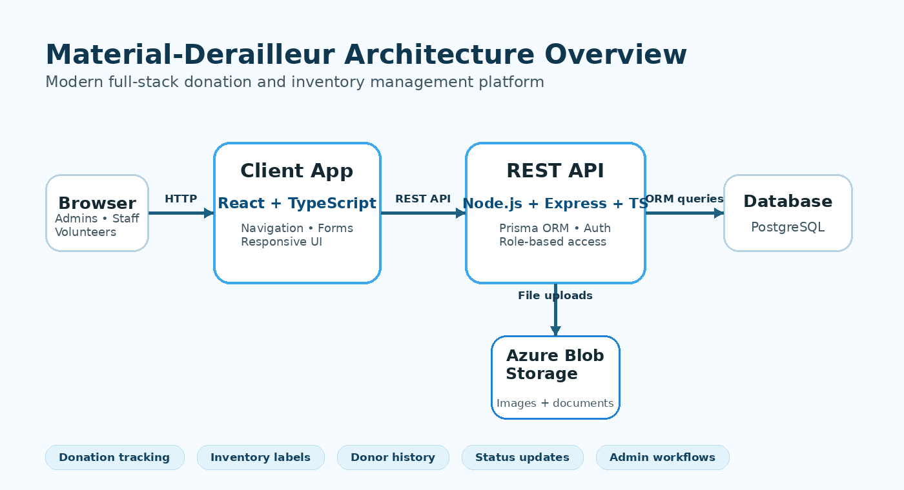

Material-Derailleur is an open-source donation, inventory, and donor engagement platform developed to help community organizations manage donated physical goods with clarity, accountability, and operational efficiency. The platform supports donation intake, item tracking, barcode labeling, donor records, and status updates through a centralized web application built for real-world nonprofit and volunteer-driven workflows.

<!--truncate-->

**What:** Building Material-Derailleur - A Unified Donation and Inventory Platform 
**Who:** Led by [Mathew Shereni](https://github.com/MATHEW-SHERENI), with development by [Cole Patrick](https://github.com/colepatrick) and [Tori Willis](https://github.com/twillis8) 
**When:** Fall 2025 / Spring 2026 
**Where:** Open Source with SLU / Saint Louis University 
**Project:** Material-Derailleur, a donation and inventory management platform for community organizations 

## Why Donation Management Matters

Community organizations often manage large volumes of donated physical goods while working with limited staff, rotating volunteers, and time-sensitive community needs. A single donated item may need to be received, inspected, categorized, repaired, stored, labeled, and eventually distributed. When this process depends on paper logs, spreadsheets, informal messages, or memory-based tracking, important details can be lost or duplicated.

The operational challenge is larger than simply storing records. Staff need to know what was donated, where each item is located, what condition it is in, who donated it, and what still needs to happen before the item can be distributed. Donors also benefit when organizations can communicate clearly, acknowledge contributions, and maintain accurate giving histories.

Material-Derailleur was created to reduce this friction. The platform gives community organizations a structured system for tracking donations from intake through storage and distribution, helping teams move from reactive recordkeeping toward more reliable inventory management.

## The Motivation Behind Material-Derailleur

Donation-based organizations deserve software that reflects the complexity and importance of their work. Many small organizations rely on tools that were not designed for physical-goods workflows. Spreadsheets may be useful at a small scale, but they become difficult to maintain as donation volume grows, item statuses change, and multiple users need access to the same information.

Material-Derailleur addresses this gap by providing a platform designed around donation operations rather than generic inventory tracking. The system supports staff, administrators, and volunteers by centralizing donation records, donor details, item status history, and barcode labels in one accessible interface.

The project also reflects the value of open-source development. By building the platform through Open Source with SLU, Material-Derailleur remains transparent, maintainable, and adaptable for organizations with different donation processes.

## What Material-Derailleur Does

Material-Derailleur supports the full lifecycle of donated items. It allows organizations to record donations, connect items to donors, update item statuses, generate barcode labels, and search inventory records through a clean administrative interface.

At a high level, the workflow is:

1. A donation is entered into the system.
2. The donated item is assigned a type, program, condition, and status.
3. A barcode label is generated for inventory tracking.
4. Staff or volunteers update the item status as work is completed.
5. Donor details remain connected to the donated item for communication and reporting.

The donated items dashboard gives users a searchable view of inventory records. Staff can search by item ID, item name, or donor; filter by item type, program, or status; and access barcode tools for labeling and tracking.

## Core Platform Capabilities

Material-Derailleur currently includes several practical features for donation-based operations:

- donation intake and donated item tracking;
- donor profile and contact management;
- item status history;
- barcode and label generation;
- inventory search and filtering;
- program-based organization of donations;
- administrative workflows for reviewing and updating donated items.

These features are designed to make the system useful in day-to-day operations. Administrators can review inventory records and donor information, while volunteers can focus on specific tasks such as receiving, sorting, repairing, storing, or preparing donated items for distribution.

## Donor Engagement Lifecycle

The donor relationship does not end when an item is received. Effective donation management also requires communication, trust, and continued engagement. Material-Derailleur helps organizations maintain donor details and connect donations to donor history, making it easier to acknowledge contributions and understand giving patterns over time.

The donor engagement lifecycle highlights how organized tracking can support stronger communication, build trust, and encourage future participation. When donor records and donation histories are easy to access, organizations are better positioned to maintain meaningful relationships with supporters.

## Architecture Overview

Material-Derailleur is built as a modern full-stack application. The frontend provides a responsive user interface for staff and volunteers, while the backend exposes REST API endpoints for donation, donor, inventory, authentication, and status-management workflows.

The architecture separates the client interface, API layer, database, and file storage so the system remains maintainable as it grows.

### Frontend

The frontend is built with React and TypeScript. This supports a component-based user interface that is easier to maintain, test, and extend. The interface is organized around practical operational actions such as searching inventory, filtering donation records, updating item details, and printing barcode labels.

### Backend

The backend uses Node.js, Express, and TypeScript to provide a structured REST API layer. TypeScript improves reliability by making data contracts clearer across the application. Prisma is used as the ORM layer, making database access more predictable and easier to manage.

### Database and Storage

PostgreSQL stores structured records such as donations, donors, item types, programs, statuses, and users. Azure Blob Storage supports file-based assets such as item images or uploaded documentation. This separation keeps the database focused on structured information while allowing the application to manage media files more efficiently.

## Implementation Insights

Material-Derailleur demonstrates the importance of designing software around real operational workflows. Donation management may appear straightforward at first, but community organizations often encounter many edge cases. Items may be damaged, repaired, moved, mislabeled, duplicated, or connected to different programs. A useful system must be flexible enough to support this complexity without making the user experience overwhelming.

The project also reinforces the importance of contributor onboarding in open-source software. Open-source projects depend on contributors being able to understand the codebase, configure the development environment, and make meaningful contributions. Clear documentation, consistent naming, organized components, and readable API structures are essential to long-term maintainability.

Most importantly, Material-Derailleur shows how software engineering can support community impact. By improving the reliability of donation and inventory workflows, the platform helps organizations spend less time searching through disconnected records and more time serving their communities.

## Current Developers

Material-Derailleur is led by:

- [Mathew Shereni](https://github.com/MATHEW-SHERENI), Tech Lead

The current development team includes:

- [Cole Patrick](https://github.com/colepatrick)
- [Tori Willis](https://github.com/twillis8)

The project is being developed through Open Source with SLU as part of an effort to build practical open-source software with real-world relevance.

## Project Links

Material-Derailleur is actively being developed as an open-source project. The following resources are available for users who want to explore the system, review the codebase, or contribute to development.

### GitHub Repository

The source code, application logic, frontend interface, backend API, database models, and ongoing development can be found on GitHub:

[View the Material-Derailleur GitHub Repository](https://github.com/oss-slu/material-derailleur)

### Open Source with SLU

Material-Derailleur is part of the Open Source with SLU community:

[Visit Open Source with SLU](https://oss-slu.github.io/)

## Looking Ahead

Material-Derailleur has a strong foundation, and future enhancements could expand its value for community organizations. Potential next steps include improved donor communication tools, stronger reporting and inventory analytics, AI-assisted item categorization, predictive inventory forecasting, mobile-friendly volunteer workflows, multi-organization support, and deeper integrations with community resource networks.

As community needs continue to grow, the systems that support donation-based organizations must also improve. Material-Derailleur represents one step toward making donation and inventory management more transparent, accessible, and sustainable for organizations that rely on donated goods.
